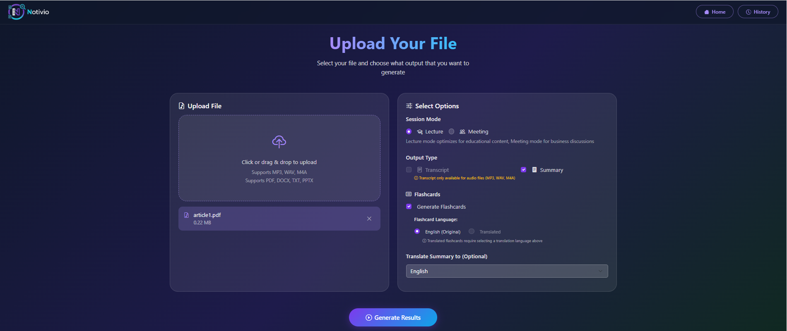

# 📝 Notivio — AI-Powered Lecture & Meeting Summarization System

> Automatically transcribe and summarize lectures or meetings from audio files and documents using state-of-the-art AI models.

---

## ✨ Features

- 🎙️ **Audio Transcription** — Upload audio files and convert speech to text using OpenAI Whisper
- 📄 **Document Summarization** — Upload PDF, DOCX, PPTX, or TXT files for instant AI-generated summaries
- 🧠 **LLM Summarization** — Structured, intelligent summaries powered by GPT-4o-mini
- 🌐 **Multilingual Translation** — Translate summaries into multiple languages
- 🃏 **Flashcard Generation** — Auto-generate study flashcards from summarized content
- 📥 **PDF Export** — Download summaries as formatted PDF reports
- 💾 **JSON Storage** — Persist session data locally in JSON format

---

## 🛠️ Tech Stack

| Layer | Technology |
|-------|-----------|
| Speech-to-Text | OpenAI Whisper (whisper-small) |
| LLM Summarization | GPT-4o-mini (OpenAI API) |
| Backend | Python, Flask |
| Document Parsing | PyMuPDF, python-docx, python-pptx |
| Frontend | HTML, CSS|
| Storage | JSON |

---

## 📸 Screenshots

## Upload Page


## Result Page
---

## 🚀 Getting Started

### Prerequisites

- Python 3.11+
- OpenAI API key

### Installation

```bash
# 1. Clone the repository
git clone https://github.com/071210/Notivio.git
cd Notivio

# 2. Create a virtual environment
python -m venv venv
source venv/bin/activate        # macOS/Linux
venv\Scripts\activate           # Windows

# 3. Install dependencies
pip install -r requirements.txt

# 4. Set up your OpenAI API key
# Create a .env file in the root directory:
echo "OPENAI_API_KEY=your_api_key_here" > .env
```

### Running the App

```bash
python app.py
```

---

## 🎯 How It Works

```
Input (Audio / Document)
        ↓
Preprocessing & Extraction
        ↓
Whisper Transcription (audio) / Text Extraction (document)
        ↓
GPT-4o-mini Summarization
        ↓
Output: Summary + Flashcards + Translation + PDF Export
```

---

## 📋 Supported File Formats

| Type | Formats |
|------|---------|
| Audio | MP3, WAV, M4A, MP4 |
| Document | PDF, DOCX, PPTX, TXT |

---

## 👨‍💻 Author

**Yew Zhi Yu**
Final Year Student — Bachelor of Computer Science (Artificial Intelligence)
Universiti Teknikal Malaysia Melaka (UTeM)

---

## 📄 License

This project is developed as a Final Year Project (FYP) for academic purposes.
